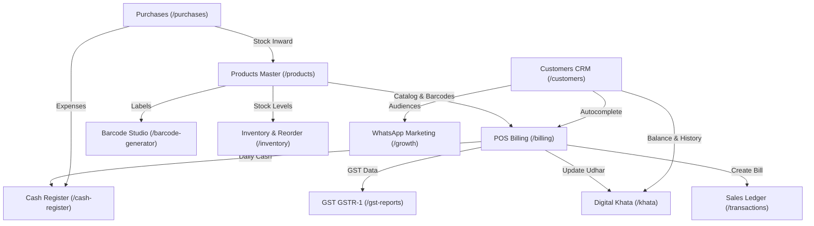

# 🗺️ KamaiPlus Feature & Dependency Registry

> **Complete Component, Route, Database, and Side-Effect Matrix.**
> Any AI agent modifying a feature MUST consult this table before making code edits.

---

## 🧭 Master Feature Matrix

| Route / Feature | Primary Components | Dexie Database Tables | Secondary Impact & Side-Effects |
| :--- | :--- | :--- | :--- |
| **`/` (Dashboard)** | • `src/app/page.tsx` • `DashboardStatsCards` • `QuickActionGrid` • `DayEndClosingReportModal` • `InvoiceModal` | `sales` `products` `customers` `cash_expenses` `businesses` | ⚠️ **Side-Effect Risk: LOW** Queries aggregated sales, expenses, and low-stock items. Modifying calculations here only impacts dashboard visual stats. |
| **`/billing` (POS Counter)** | • `src/app/billing/page.tsx` • `BarcodeScannerModal` • `CustomerSearchAutocomplete` • `HardwareManagerModal` • `InvoiceModal` • `PaymentCelebrationModal` | `sales` `products` `customers` `ledger_transactions` `inventory_movements` | 🚨 **Side-Effect Risk: HIGH** Submitting a bill mutates **Product Stock**, **Customer Khata Balance**, and **Cash Drawer**. Changes here impact `/inventory`, `/khata`, and `/transactions`. |
| **`/inventory` (Stock & Expiry)** | • `src/app/inventory/page.tsx` • `ReorderSupplierCards` • `StockAdjustModal` • `BatchExpiryTable` | `products` `inventory_movements` `suppliers` | ⚠️ **Side-Effect Risk: MEDIUM** Changing stock quantities here directly affects POS item availability on `/billing` and low-stock indicators on `/`. |
| **`/products` (Catalog Master)** | • `src/app/products/page.tsx` • `ProductModal` • `RapidBarcodeInwardModal` • `ExcelInventoryImporter` • `PurchaseInwardOptionsSheet` | `products` `categories` `inventory_movements` | 🚨 **Side-Effect Risk: HIGH** Product price, tax rate, and barcode changes directly affect invoice calculations on `/billing` and barcodes on `/barcode-generator`. |
| **`/khata` (Udhar Ledger)** | • `src/app/khata/page.tsx` • `KhataEntryModal` • `CustomerAddModal` • `EditTransactionModal` • `WhatsAppReminderButton` | `customers` `ledger_transactions` | 🚨 **Side-Effect Risk: HIGH** Recording or deleting an Udhar entry updates customer credit balances, which are shown on `/billing` and `/customers`. |
| **`/customers` (CRM)** | • `src/app/customers/page.tsx` • `CustomerModal` • `CustomerTable` | `customers` `ledger_transactions` | ⚠️ **Side-Effect Risk: MEDIUM** Editing customer phone numbers affects WhatsApp receipt delivery from `/billing` and reminders from `/khata`. |
| **`/transactions` (Sales Ledger)** | • `src/app/transactions/page.tsx` • `InvoiceModal` • `ReceiptPrintSheet` • `ReturnRefundModal` | `sales` `products` `customers` `ledger_transactions` | ⚠️ **Side-Effect Risk: MEDIUM** Processing a return/refund here re-credits product stock and customer balance. |
| **`/purchases` (Sourcing & Bills)** | • `src/app/purchases/page.tsx` • `SupplierModal` • `PurchaseBillModal` | `purchases` `suppliers` `products` `cash_expenses` | ⚠️ **Side-Effect Risk: MEDIUM** Vendor purchase inward increments product stock and logs cash outflow in `/cash-register`. |
| **`/cash-register` (Cash Drawer)** | • `src/app/cash-register/page.tsx` • `DenominationCounter` • `CashInflowOutflowModal` • `DayEndReportModal` | `cash_registers` `cash_expenses` `sales` | ⚠️ **Side-Effect Risk: LOW** Reconciles daily physical cash against system sales from `/billing`. |
| **`/growth` (WhatsApp Marketing)** | • `src/app/growth/page.tsx` • `CampaignCard` • `AudienceSegmentModal` | `customers` | ⚠️ **Side-Effect Risk: LOW** Broadcasts WhatsApp campaign templates to customer lists. |
| **`/gst-reports` (Tax Compliance)** | • `src/app/gst-reports/page.tsx` • `Gstr1SummaryTable` • `HsnSummaryTable` • `ExcelExportButton` | `sales` | ⚠️ **Side-Effect Risk: LOW** Read-only aggregation of tax rates, HSN codes, and invoice amounts. |
| **`/barcode-generator` (Studio)** | • `src/app/barcode-generator/page.tsx` • `BarcodeDesigner` • `PrintPreviewSheet` | `products` | ⚠️ **Side-Effect Risk: LOW** Renders printable barcode labels for existing items in catalog. |
| **`/invoice-designer` (Themes)** | • `src/app/invoice-designer/page.tsx` • `ThemeSelector` • `ReceiptPreview` | `businesses` | ⚠️ **Side-Effect Risk: MEDIUM** Updates invoice layout settings, header, footer, and logo used across `/billing` and `/transactions`. |
| **`/cloud-backup` (Data Vault)** | • `src/app/cloud-backup/page.tsx` • `BackupExportEngine` • `RestoreModal` | All Dexie Tables | 🚨 **Side-Effect Risk: CRITICAL** Restoring from a backup replaces local Dexie tables. |
| **`/auth` & `/onboarding`** | • `src/app/auth/page.tsx` • `src/components/auth/AuthForm.tsx` • `src/app/onboarding/page.tsx` | `businesses` `merchants` | 🚨 **Side-Effect Risk: CRITICAL** Controls authentication tokens, device data reset, and initial store creation. |

---

## 🔄 Dependency Cross-Reference

---

## ⚡ Golden Rules for Safe Modification

1. **Changing a Product's price or tax rate?** Verify how it displays in `src/app/billing/page.tsx` and computes in `src/lib/invoices/gstCalculator.ts`.
2. **Changing a Customer's balance?** Verify that both `src/app/khata/page.tsx` and `src/app/customers/page.tsx` reflect the exact same integer paise.
3. **Changing an Invoice Theme?** Test both 58mm thermal output and A4 desktop print preview.
