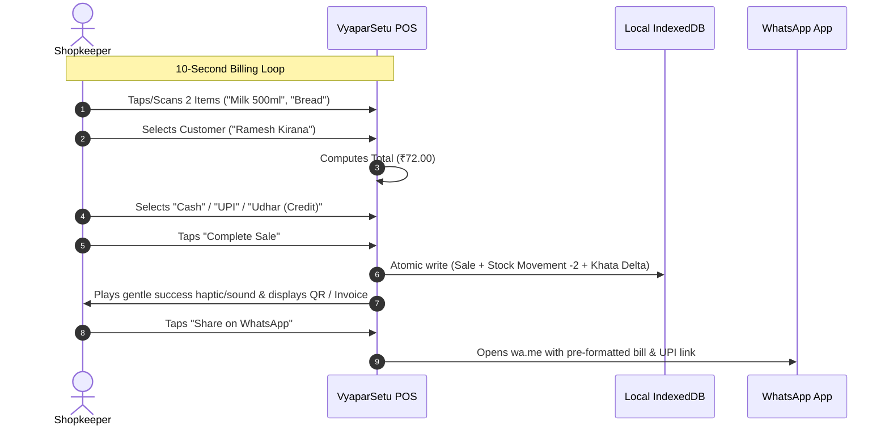

# VyaparSetu (व्यापार सेतु) - Product Architecture & Specification
## Offline-First Business Management & Growth Platform for Indian Small Businesses
**Philosophy:** *SELL → MANAGE → GROW*

---

## 1. Executive Summary & Product Vision

### 1.1 The Problem
Over 63 million Micro, Small, and Medium Enterprises (MSMEs) in India manage their daily operations across fragmented, paper-based ledgers (Bahi Khata), clunky desktop accounting software (Tally/Busy), or subscription-heavy apps with rigid internet dependencies. Common challenges include:
- **Billing friction:** Long checkout queues due to slow, keyboard-heavy ERP interfaces.
- **Credit tracking (Udhar):** Lost revenue and forgotten balances due to manual notebook records.
- **Customer Churn:** Inability to identify inactive customers or re-engage past buyers without expensive SMS/CRM packages.
- **Unreliable Connectivity:** Frequent internet outages in Tier 2/3 cities and rural marketplaces causing software lockouts.
- **Language & Tech Barriers:** High cognitive load from complex accounting terminology (Debits, Credits, Journal Entries).

### 1.2 The Solution: VyaparSetu
A free, open-source, mobile-first, offline-first Progressive Web Application (PWA) designed specifically for Indian retailers, kirana store owners, service providers, and wholesalers. 

It is anchored on three core pillars:
1. **SELL:** High-speed mobile billing (≤ 10 seconds), GST/Non-GST invoices, UPI QR generation, instant WhatsApp receipts, barcode & voice search.
2. **MANAGE:** Real-time inventory tracking, purchase management, customer/supplier digital Khata (Udhar ledger), cash register, and low-stock alerts.
3. **GROW:** Automated inactive customer detection (RFM foundation), loyalty points, festival marketing templates, personalized WhatsApp offers, and coupon engine.

---

## 2. Core Pillars & Module Decomposition

```mermaid
graph TD
    App[VyaparSetu Core] --> Sell[SELL]
    App --> Manage[MANAGE]
    App --> Grow[GROW]
    App --> Foundation[FOUNDATION & TRUST]

    Sell --> S1[Fast POS Billing & Quick Cart]
    Sell --> S2[GST & Non-GST Invoicing]
    Sell --> S3[UPI Dynamic QR & Deep Links]
    Sell --> S4[WhatsApp Receipt & Web Share]
    Sell --> S5[Barcode & Voice Item Entry]

    Manage --> M1[Inventory & Stock Movements]
    Manage --> M2[Purchases & Supplier Master]
    Manage --> M3[Digital Khata - Customer & Supplier]
    Manage --> M4[Daily Cash Register & Petty Cash]
    Manage --> M5[Low-Stock Attention Radar]

    Grow --> G1[Customer Lifecycle & Retention Radar]
    Grow --> G2[Automated Inactive Customer Alerts]
    Grow --> G3[Festival & Promotional WhatsApp Templates]
    Grow --> G4[Configurable Loyalty Points Engine]
    Grow --> G5[Custom Coupon & Discount System]

    Foundation --> F1[Offline-First IndexedDB Dexie]
    Foundation --> F2[Event-Sourced Sync Queue]
    Foundation --> F3[Multi-Language: EN / HI / MR]
    Foundation --> F4[Granular Multi-Role RBAC]
    Foundation --> F5[Local Backup & JSON Export/Import]
```



### Module 1: Smart Billing & Invoicing (SELL)
- **Fast POS Interface:** Optimized for touchscreens (360px+) with categories, quick-add grid, barcode camera scanner, and voice-assisted natural language item addition.
- **Flexible Pricing & Taxes:** Real-time line item discounts, bill-level discounts, GST auto-calculation (CGST, SGST, IGST), tax-inclusive and tax-exclusive pricing.
- **Multi-Modal Payments:** Split payments across Cash, UPI (auto dynamic QR `upi://pay?pa=...`), Card, Bank Transfer, and Credit (Udhar to Khata).
- **Invoice & Thermal Printing:** Instant client-side PDF generation, 58mm/80mm thermal receipt CSS print styles, and standard A4 invoice layouts.
- **Zero-Cost WhatsApp Sharing:** One-tap sharing via `https://wa.me/{phone}?text={encodedInvoiceSummary}` with zero third-party API costs or account risks.

### Module 2: Inventory & Purchases (MANAGE)
- **Immutable Inventory Movements:** Every stock change records an immutable `InventoryMovement` (SALE, PURCHASE, RETURN, ADJUSTMENT, DAMAGE).
- **Multi-Unit Support:** Pieces, Kg, Grams, Litres, ml, Boxes, Packets, Dozens, Meters, Feet, and custom units with decimal quantities.
- **Smart Attention Items:** Dynamic alerts for items breaching `min_stock_level` with one-tap purchase order generation.
- **Supplier Ledger Integration:** Auto-credit updates when purchases are made on credit terms.

### Module 3: Digital Khata & Customer Profiles (MANAGE + GROW)
- **Customer Udhar Khata:** Event-sourced ledger balance calculation (`Opening Balance + Credit Sales - Payments Received ± Adjustments`).
- **One-Tap WhatsApp Reminders:** Pre-formatted polite payment reminders with UPI payment link embedded.
- **Customer 360° Profile:** Purchase frequency, total lifetime value (LTV), average order value (AOV), favorite items, loyalty ledger, and activity status.

### Module 4: Growth Engine & WhatsApp Marketing (GROW)
- **Automated Retention Engine:** Dynamically categorizes customers into *New*, *Regular*, *VIP*, *Credit Risk*, and *Inactive (30/45/60+ days)*.
- **Variable Template Engine:** Built-in festival templates (Diwali, Eid, Holi, Ganesh Chaturthi, New Year, Independence Day, Weekend Offers) with dynamic variable interpolation (`{{customer_name}}`, `{{discount}}`, `{{business_name}}`, `{{coupon_code}}`).
- **Loyalty & Rewards:** Configurable spend-to-point ratios (e.g., ₹100 spent = 1 point, 10 points = ₹10 off) with auditable points ledger.
- **Coupons:** Flat and percentage discounts with minimum order thresholds, usage limits, and validity windows.

### Module 5: Accessibility & Trust Layer
- **Trilingual Localization:** Complete internationalization dictionary support for English (`en`), Hindi (`hi`), and Marathi (`mr`), architected for easy extension to Gujarati, Tamil, Telugu, Kannada, and Bengali.
- **Local-First PWA:** Full service worker caching, IndexedDB persistence, offline indicators, and atomic local export/restore.
- **Financial Precision:** Strict integer minor-unit (paise) storage to eliminate floating-point rounding discrepancies.

---

## 3. Technical Architecture & Technology Stack

```
+-------------------------------------------------------------------------------+
|                             CLIENT APPLICATION (PWA)                          |
|                                                                               |
|  +-------------------------+  +------------------------+  +----------------+  |
|  |   Next.js 14+ / React   |  |   Tailwind CSS + UI    |  |  i18n Engine   |  |
|  |  (App Router + TS strict|  |  (Custom Design System)|  |  (EN / HI / MR)|  |
|  +-------------------------+  +------------------------+  +----------------+  |
|                                                                               |
|  +-------------------------------------------------------------------------+  |
|  |                            DOMAIN SERVICES LAYER                        |  |
|  |  * BillingService        * InventoryService      * KhataService         |  |
|  |  * WhatsAppService       * RetentionEngine       * LoyaltyService       |  |
|  |  * PdfPrintService       * BarcodeScannerService * SpeechService        |  |
|  +-------------------------------------------------------------------------+  |
|                                                                               |
|  +-------------------------------------------------------------------------+  |
|  |                       LOCAL PERSISTENCE LAYER (Dexie.js)                |  |
|  |  * businesses   * products    * sales       * customers   * ledger      |  |
|  |  * inventory    * purchases   * sync_queue  * audit_logs  * settings    |  |
|  +-------------------------------------------------------------------------+  |
|                                     |                                         |
|  +----------------------------------v--------------------------------------+  |
|  |                    OFFLINE / SYNC WORKER & SERVICE WORKER               |  |
|  |  * Background Sync Queue   * Conflict Resolver   * Network Status Radar |  |
|  +-------------------------------------------------------------------------+  |
+-------------------------------------------------------------------------------+
                                      | (When Online / Cloud Sync enabled)
                                      v
+-------------------------------------------------------------------------------+
|                       FUTURE / OPTIONAL BACKEND ADAPTER                       |
|     (FastAPI / Node.js + PostgreSQL Multi-Tenant Database + JWT Auth)         |
+-------------------------------------------------------------------------------+
```

### Technology Matrix
| Layer | Technology | Rationale |
|---|---|---|
| **Framework** | Next.js 14+ (App Router) + React 18/19 | SSR/SSG capability, modular structure, strict TypeScript support, excellent PWA integration. |
| **Language** | TypeScript (Strict Mode) | Strong domain type-safety, preventing runtime errors in financial math. |
| **Styling** | Tailwind CSS + Vanilla CSS Tokens | Lightweight, mobile-first responsive utility styling, rich design tokens, dark/light contrast. |
| **Local Database** | IndexedDB via **Dexie.js** | Industry standard for reactive, transactional, indexed client-side storage up to gigabytes. |
| **Icons** | Lucide React | Clean, lightweight, consistent SVG icon set. |
| **Validation** | Zod | Runtime schema validation for forms, database models, and sync payloads. |
| **Printing/PDF** | Native `window.print` + `jspdf` / `html2canvas` | Zero external API costs; client-side vector thermal and A4 bill printing. |
| **Barcode Scan** | Native BarcodeDetector API + `@zxing/library` / `html5-qrcode` fallback | Fast camera scanner with zero paid dependencies; USB barcode scanner keyboard support. |
| **Voice Entry** | Browser Web Speech API (`webkitSpeechRecognition`) | Natural Hindi/Marathi/English spoken item input without paid speech-to-text APIs. |
| **Public Data APIs** | Open Food Facts API / India Pincode API | Automatic product barcode enrichment and address autofill. |

---

## 4. Database Schema Design (IndexedDB & Relational Mapping)

### 4.1 Dexie.js Client Database Schema (`VyaparSetuDB`)

```typescript
// All monetary amounts stored as integer paise (1 INR = 100 paise)
export interface Business {
  id: string; // UUID v4
  name: string;
  business_type: 'grocery' | 'clothing' | 'electronics' | 'bakery' | 'salon' | 'hardware' | 'stationery' | 'mobile' | 'restaurant' | 'services' | 'other';
  phone: string;
  email?: string;
  address: string;
  gstin?: string;
  upi_id?: string;
  currency: string; // default 'INR'
  language: 'en' | 'hi' | 'mr';
  invoice_prefix: string; // e.g. "INV-"
  next_invoice_number: number;
  terms_conditions?: string;
  footer_message?: string;
  created_at: string;
  updated_at: string;
  sync_status: 'synced' | 'pending' | 'conflict';
}

export interface Product {
  id: string;
  business_id: string;
  name: string;
  sku?: string;
  barcode?: string;
  category_id: string;
  unit: string; // 'piece' | 'kg' | 'gram' | 'litre' | 'ml' | 'box' | 'packet' | 'dozen' | 'meter' | 'foot' | 'custom'
  purchase_price: number; // in paise
  selling_price: number; // in paise
  mrp: number; // in paise
  tax_rate: number; // percentage (0, 5, 12, 18, 28)
  is_tax_inclusive: boolean;
  hsn_code?: string;
  current_stock: number;
  min_stock_level: number;
  supplier_id?: string;
  is_favorite: boolean;
  is_active: boolean;
  created_at: string;
  updated_at: string;
  sync_status: 'synced' | 'pending';
}

export interface Customer {
  id: string;
  business_id: string;
  name: string;
  phone: string;
  email?: string;
  address?: string;
  opening_balance: number; // in paise (+ = owes us, - = advance)
  current_balance: number; // in paise
  loyalty_points: number;
  total_spent: number; // in paise
  total_visits: number;
  last_visit_date?: string;
  customer_type: 'new' | 'regular' | 'vip' | 'inactive' | 'credit';
  notes?: string;
  created_at: string;
  updated_at: string;
  sync_status: 'synced' | 'pending';
}

export interface Sale {
  id: string;
  business_id: string;
  invoice_number: string;
  customer_id?: string;
  customer_name?: string;
  customer_phone?: string;
  items: Array<{
    product_id: string;
    product_name: string;
    quantity: number;
    unit: string;
    unit_price: number; // in paise
    discount_amount: number; // in paise
    tax_rate: number;
    tax_amount: number; // in paise
    total_amount: number; // in paise
  }>;
  subtotal: number; // in paise
  discount_total: number; // in paise
  tax_total: number; // in paise
  grand_total: number; // in paise
  payment_method: 'cash' | 'upi' | 'card' | 'bank_transfer' | 'credit' | 'split';
  amount_received: number; // in paise
  balance_due: number; // in paise (added to customer Khata if credit)
  payment_status: 'paid' | 'partial' | 'unpaid';
  status: 'completed' | 'cancelled' | 'draft';
  notes?: string;
  created_by: string; // user_id
  created_at: string;
  updated_at: string;
  sync_status: 'synced' | 'pending';
}

export interface InventoryMovement {
  id: string;
  business_id: string;
  product_id: string;
  movement_type: 'SALE' | 'PURCHASE' | 'RETURN' | 'ADJUSTMENT' | 'DAMAGE';
  quantity: number; // positive for addition, negative for deduction
  previous_stock: number;
  new_stock: number;
  reference_id?: string; // sale_id or purchase_id
  reason?: string;
  created_by: string;
  created_at: string;
}

export interface LedgerTransaction {
  id: string;
  business_id: string;
  party_type: 'customer' | 'supplier';
  party_id: string;
  transaction_type: 'CREDIT_SALE' | 'PAYMENT_RECEIVED' | 'CREDIT_PURCHASE' | 'SUPPLIER_PAYMENT' | 'OPENING_BALANCE' | 'ADJUSTMENT';
  amount: number; // in paise
  payment_method?: string;
  reference_id?: string; // sale_id or purchase_id
  notes?: string;
  created_at: string;
}

export interface MarketingTemplate {
  id: string;
  title: string;
  category: 'festival' | 'sale' | 'new_arrival' | 'discount' | 'loyalty' | 'reminder' | 'appreciation';
  language: 'en' | 'hi' | 'mr';
  template_text: string;
  is_custom: boolean;
}

export interface SyncQueueItem {
  id: string;
  entity_table: string;
  entity_id: string;
  operation: 'INSERT' | 'UPDATE' | 'DELETE';
  payload: any;
  device_id: string;
  user_id: string;
  client_timestamp: string;
  attempts: number;
  last_error?: string;
}

export interface AuditLog {
  id: string;
  business_id: string;
  user_id: string;
  user_name: string;
  action: string;
  entity_type: string;
  entity_id: string;
  details: string;
  created_at: string;
}
```

---

## 5. Offline & Synchronization Architecture

### 5.1 Local-First Mutation Pipeline
```
[User Action on UI]
       │
       ▼
[Validate with Zod Schema]
       │
       ▼
[Atomic Dexie Transaction] ──► [Instant UI Update (< 16ms)]
       │
       ├──► Writes to Domain Table (e.g. `sales`, `inventory_movements`)
       ├──► Updates Aggregate / Balance (e.g. `product.current_stock`)
       ├──► Appends to `audit_logs`
       └──► Appends mutation to `sync_queue` (Status: 'pending')
       │
       ▼
[Sync Engine Radar]
       │
       ├── Is Online? ── No ──► Retain in IndexedDB & Show "Offline Mode (Safe)"
       │
       └── Yes ──► Dequeue in Strict FIFO Order
                   │
                   ▼
             [POST /api/sync/batch]
                   │
                   ▼
             [Server Confirms Commit]
                   │
                   ▼
             [Mark Local Record as 'synced']
```

### 5.2 Conflict Resolution Strategy
- **Event-Sourced Reconciliation:** Stock changes and Khata balances are synced as **delta mutations** (`quantity: -2`, `amount: +50000`) rather than absolute snapshot overwrites.
- **Entity Last-Write-Wins with Field Merging:** For product metadata (e.g. price change), the latest `client_timestamp` prevails, while maintaining an audit trail.

---

## 6. Security Model & Role-Based Access Control (RBAC)

### 6.1 User Roles & Permission Matrix
| Permission | OWNER | MANAGER | CASHIER | STAFF |
|---|:---:|:---:|:---:|:---:|
| `billing.create` | ✅ | ✅ | ✅ | ✅ |
| `billing.cancel` | ✅ | ✅ | ❌ | ❌ |
| `billing.discount_override` | ✅ | ✅ | ❌ | ❌ |
| `product.create_edit` | ✅ | ✅ | ❌ | ❌ |
| `inventory.adjust` | ✅ | ✅ | ❌ | ❌ |
| `khata.view` | ✅ | ✅ | ✅ | ❌ |
| `khata.record_payment` | ✅ | ✅ | ✅ | ❌ |
| `marketing.send` | ✅ | ✅ | ❌ | ❌ |
| `reports.view_profit` | ✅ | ❌ | ❌ | ❌ |
| `settings.manage` | ✅ | ❌ | ❌ | ❌ |
| `backup.export_restore` | ✅ | ❌ | ❌ | ❌ |

### 6.2 Data Privacy & Isolation
- Strict business-level scoping on all queries (`where({ business_id })`).
- PII (customer phone numbers and balances) never broadcast to analytics.
- Local JSON exports encrypted or sanitized.

---

## 7. High-Value User Journeys & 10-Second UX Benchmarks



### 10-Second Benchmark Goals
1. **Bill Creation:** $\le 8$ seconds for 3 items.
2. **Khata Lookup & Payment Recording:** $\le 5$ seconds.
3. **Low Stock Detection to Restock Order:** $\le 10$ seconds.
4. **Inactive Customer Contact:** $\le 3$ taps to WhatsApp pre-filled greeting.

---

## 8. Phased Implementation Roadmap

```
  ┌──────────────────────────────────────────────────────────┐
  │ PHASE 1: Shell, Onboarding, Dexie DB & Products [TARGET] │
  └────────────────────────────┬─────────────────────────────┘
                               ▼
  ┌──────────────────────────────────────────────────────────┐
  │ PHASE 2: High-Speed POS Billing, Invoicing & WhatsApp    │
  └────────────────────────────┬─────────────────────────────┘
                               ▼
  ┌──────────────────────────────────────────────────────────┐
  │ PHASE 3: Inventory Movements, Purchases & Stock Alerts   │
  └────────────────────────────┬─────────────────────────────┘
                               ▼
  ┌──────────────────────────────────────────────────────────┐
  │ PHASE 4: Digital Udhar Khata & Customer 360° Profiles   │
  └────────────────────────────┬─────────────────────────────┘
                               ▼
  ┌──────────────────────────────────────────────────────────┐
  │ PHASE 5: Growth Engine (Retention Radar, Loyalty, Promo) │
  └────────────────────────────┬─────────────────────────────┘
                               ▼
  ┌──────────────────────────────────────────────────────────┐
  │ PHASE 6: PWA Hardening, Backup/Restore & Local Analytics │
  └──────────────────────────────────────────────────────────┘
```

---

## 9. Phase 1 Implementation Plan (Target Milestone)

### Scope of Phase 1:
1. **Next.js 14 App Architecture & Design System:**
   - Tailwind CSS design system with custom Indian currency formatting, responsive mobile shell (bottom nav + desktop sidebar).
   - Trilingual i18n support (`en`, `hi`, `mr`).
2. **Local Database & Dexie.js Persistence Engine:**
   - `VyaparSetuDB` initialized with full schema and automatic demo seed data for Kirana/Retail.
3. **Business Onboarding Flow:**
   - 4-step rapid onboarding (Business Name, Type, Contact/GSTIN/UPI, Language) with instant dashboard redirection.
4. **Product Master & Category Management:**
   - Add/edit/archive products, multi-unit selector, barcode scanning via camera + search, stock indicators, and quick-filter category pills.
5. **Dashboard "Attention Radar":**
   - High-priority operational cards (Today's Sales, Low Stock alert banner, Quick Sell action button).

---
*Created on 2026-08-14 | VyaparSetu Engineering Architecture Team*
